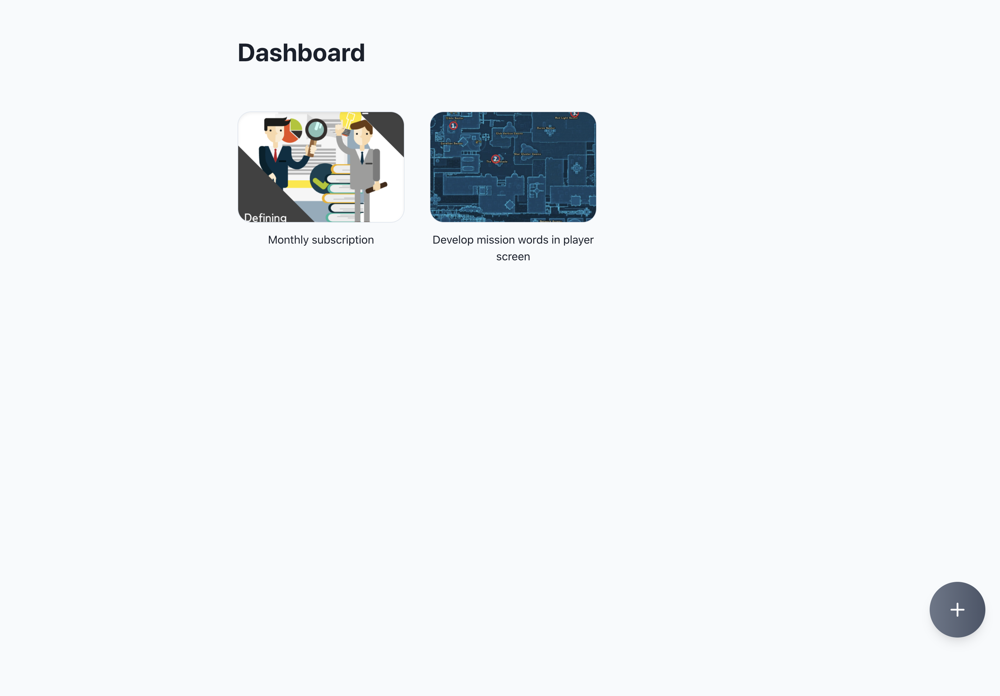
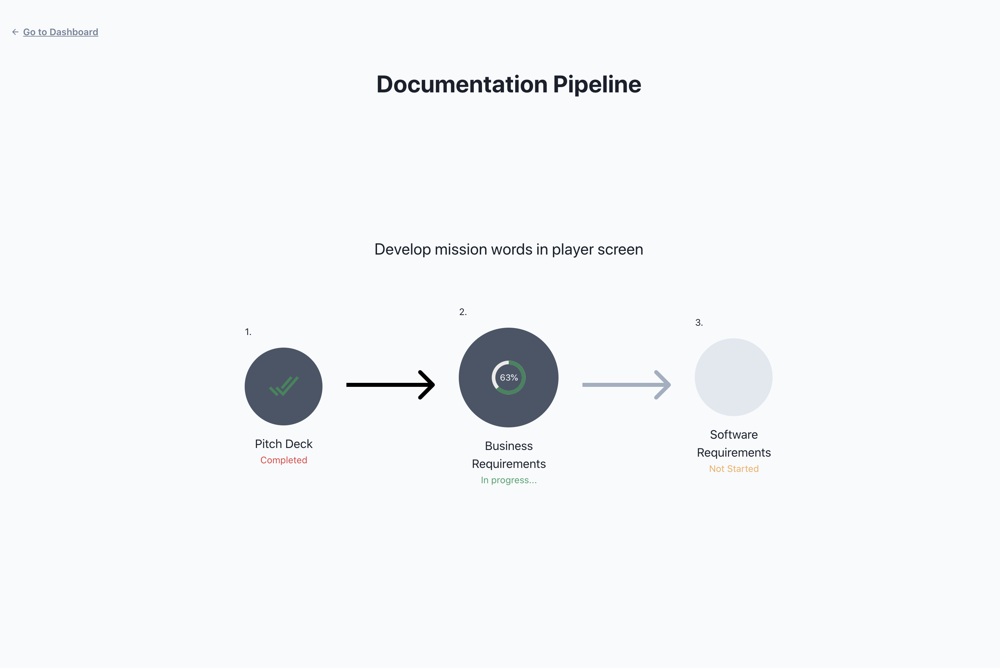
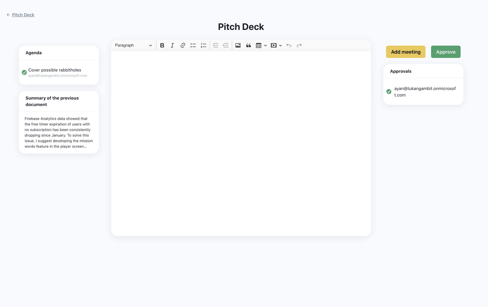
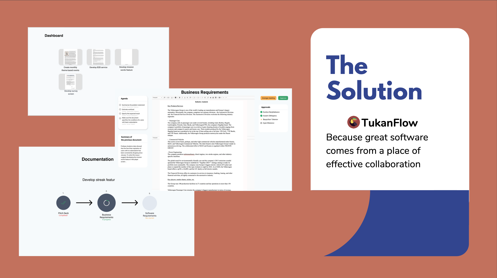
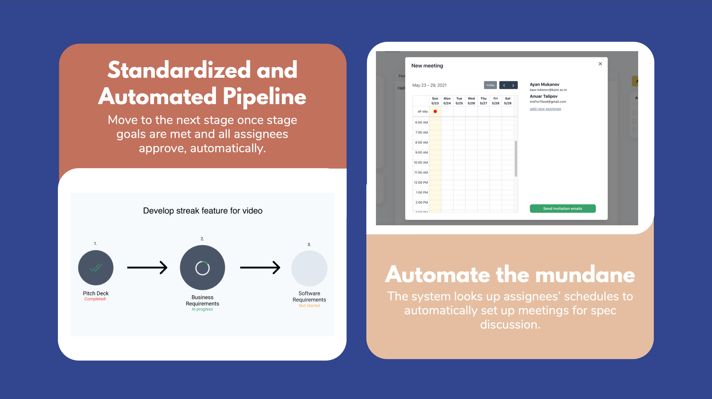
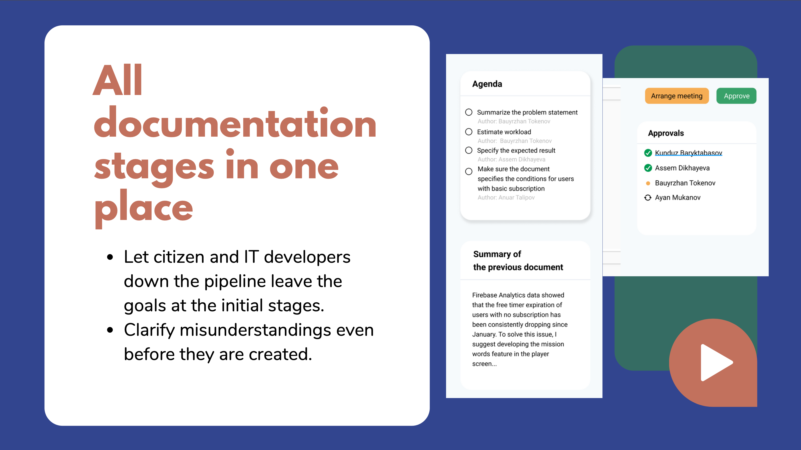

# TukanFlow

Documentation writing pipeline for better collaboration of fusion teams.
Project submitted for Microsoft track on [JunctionX Seoul 2021](https://app.hackjunction.com/events/junctionx-seoul-2021?utm_source=PT&utm_medium=AWS) Hackathon.

Demo link: [tukanflow-frontend.azurewebsites.net/dashboard](https://tukanflow-frontend.azurewebsites.net/dashboard)

Backend repo link: [github.com/BaurTokenov/tukanflow-nodejs-backend](https://github.com/BaurTokenov/tukanflow-nodejs-backend)
## Technologies used

- Microsoft Azure Web Services - hosting and database
- Microsoft Azure Compute - text summarization
- Microsoft Graph API - calendar, email sending system
- Microsoft Outlook
- ReactJS, GraphQL, MongoDB, Node.js
## Running

In the project directory, run:

### `npm start`

Open [http://localhost:3000](http://localhost:3000) to view it in the browser.

## Contributors
- [Anuar Talipov](https://github.com/anuarTB)
- [Assem Dikhayeva](https://github.com/asemdi)
- [Ayan Mukanov](https://github.com/mukanov8)
- [Bauyrzhan Tokenov](https://github.com/BaurTokenov)
- [Kunduz Baryktabasova](https://github.com/kunduzb17)
- [Silap Aliyev](https://github.com/s9v)

## Screenshots

## Presentation Screenshots

